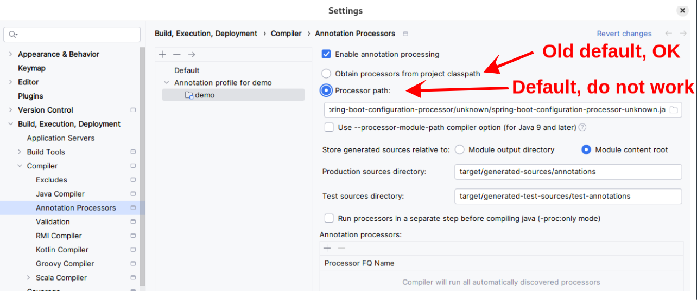

# calcify

application does not run because mysql dependency is looking for a data source configuration.

can't expose db password and other sensitive data:

- use jasypt -- https://github.com/ulisesbocchio/jasypt-spring-boot
- see `src/main/resources/application.yml`
- IntelliJ, Run/Debug Configurations -> Modify Options -> Add VM options
    - add like so ...
  ```
  -Djasypt.encryptor.password="yourencryptorpasswordhere"
  ```
    - run as normally now

### Lombok/Spring/IntelliJ issue.
lombok in `domain.User` class is not building out the getters and setters correctly causing an error.
The error occurs in the `repository.implementation.UserRepositoryImpl` class.

```java

@Override
public User create(User user) {
    // Check whether the email is unique
    if (getEmailCount(user.getEmail()
            .trim()
            .toLowerCase()) > 0)
        throw new ApiException("Email already in use. Please use a different email and try again.");
}

```

*Compiler complains that `user.getEmail()` is not found*. This points the issue to lombok.

things that did not work:
- enabling annotations
- invalidating VCS cache
- invalidating cache all options
- downgrading project to 3.3.* from 3.4.*
- deleting .idea directory and restarting ide

#### Solution
The solution is a combination of doing `mvn clean install`, followed by attempting to run the application, invalidating the VCS cache, restart IntelliJ and re-run the program, and then go into the "Enable Annotation Processing" settings and doing the steps below:

https://intellij-support.jetbrains.com/hc/en-us/community/posts/23064675521682-Lombok-not-workin-with-Intellij

File > Settings > Build,Execution,Deployment > Compiler > Annotation Processors
```
Ok found the culprit: 

With new project the processor is “obtain from a static jar file” … that do not exist.  

   Switching back to the old default version (option that I have on old project)  it is OK. 

So solution:  Switch to “obtain processors from project classpath”.
```



Processor path to lombok:
```shell
/home/seong/.m2/repository/org/projectlombok/lombok/unknown/lombok-unknown.jar
```

Looking at the issue again. It works after I change it back to the processor path from the project classpath.


---

remember: need mysql db running for the application run